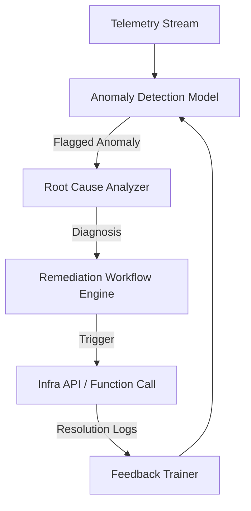

**This is an idea that I got and I thought to keep it on the open-source to invite more brains to work on it**

---

# 💤 Let the DevOps Guy Sleep

### *An Open Initiative for Building Self-Healing Observability Systems*

---

## 🧠 The Idea

Modern cloud systems are **massively distributed, noisy, and fragile**. We’ve built great dashboards, alerting tools, and pipelines — yet the 2 AM pager still rings.

**Let the DevOps Guy Sleep** is an open engineering initiative aimed at creating **self-healing observability systems** — systems that don’t just *monitor* failures but *understand* and *resolve* them automatically.

Our goal:

> Build intelligent, event-driven infrastructure that detects, diagnoses, and heals itself — without human intervention.

This isn’t about replacing engineers. It’s about freeing them to solve complex problems while the system handles the predictable ones.

---

## ⚙️ The Core Architecture

At its heart, a self-healing observability system consists of **three core layers**:

### 1. **Data & Observability Layer**

This layer is responsible for collecting **telemetry data** — metrics, logs, traces, and events — from distributed systems.
Typical tools here include:

* Metrics collectors (e.g., Prometheus, Cloud Monitoring, OpenTelemetry)
* Log pipelines (e.g., Fluentd, Cloud Logging, Elastic)
* Tracing frameworks (e.g., Jaeger, Zipkin)

The collected data serves as the foundation for **intelligent anomaly detection**.

---

### 2. **Intelligence Layer (AI/ML Engine)**

This is where the system gets smart.
Using AI and ML — for example, via **Vertex AI**, **SageMaker**, or **custom models** — this layer performs:

* **Anomaly detection** – spotting unusual patterns in telemetry.
* **Root cause analysis** – correlating events across services to infer likely sources of failure.
* **Predictive maintenance** – anticipating issues before they escalate.
* **Adaptive thresholding** – dynamically learning “normal” system behavior.

The intelligence layer continuously learns from historical data and feedback, becoming smarter over time.

---

### 3. **Action Layer (Automation & Remediation Engine)**

Once an anomaly or incident is identified, the system must respond — fast.

This layer includes:

* **Automated workflows** triggered via webhooks, functions, or pipelines (e.g., Cloud Functions, Lambda, Argo Workflows)
* **Policy-based healing**, such as restarting a crashed pod, scaling up instances, or clearing faulty caches
* **Human-in-the-loop overrides** for safe rollbacks or approvals
* **Feedback logging** into the AI model for reinforcement learning

The result: incidents get resolved **in minutes, not hours**, and DevOps stays blissfully asleep.

---

## 🏗️ Example Flow (Conceptual)

This feedback loop ensures **continuous learning** — every incident makes the system better at handling the next one.

---

## 🧩 Project Goals

| Milestone                    | Description                                                                               |
| ---------------------------- | ----------------------------------------------------------------------------------------- |
| **v0.1 – Prototype**         | Build a basic anomaly detector that listens to log streams and triggers a scripted fix.   |
| **v0.2 – ML-Driven RCA**     | Integrate an AI engine (Vertex AI / custom TensorFlow model) for correlating root causes. |
| **v0.3 – Event Automation**  | Connect the RCA output to an automation layer (e.g., Cloud Run, GitHub Actions).          |
| **v1.0 – Self-Healing Core** | Establish a feedback loop where system performance improves autonomously.                 |

---

## 🤝 Contributing

We welcome contributions from **DevOps engineers, AI enthusiasts, SREs, and system architects**.
You can help by:

* Designing architecture blueprints
* Writing adapters for various observability stacks
* Training and optimizing anomaly detection models
* Building safe automation workflows
* Writing documentation, demos, or tutorials

> The end goal: create a universal framework that any team can plug into their existing observability stack to make it self-healing.

---

## 🌍 Vision

Imagine a world where:

* PagerDuty incidents are *auto-resolved* before they escalate
* Cloud systems adaptively scale based on predictive analytics
* Logs tell stories to models that can prevent future failures
* And yes — your DevOps guy actually sleeps peacefully through the night 😴

This is not the future — it’s the next step in *reliable, intelligent DevOps*.

---

## 📜 License

MIT License — open for all to learn, build, and improve.

---

